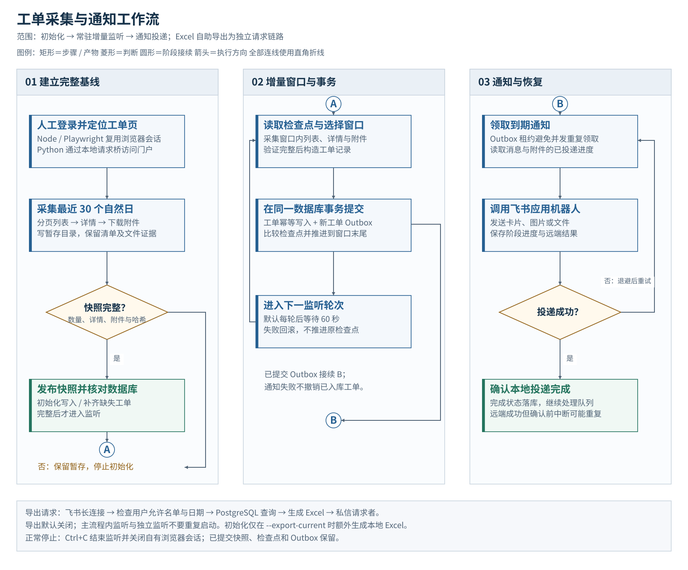
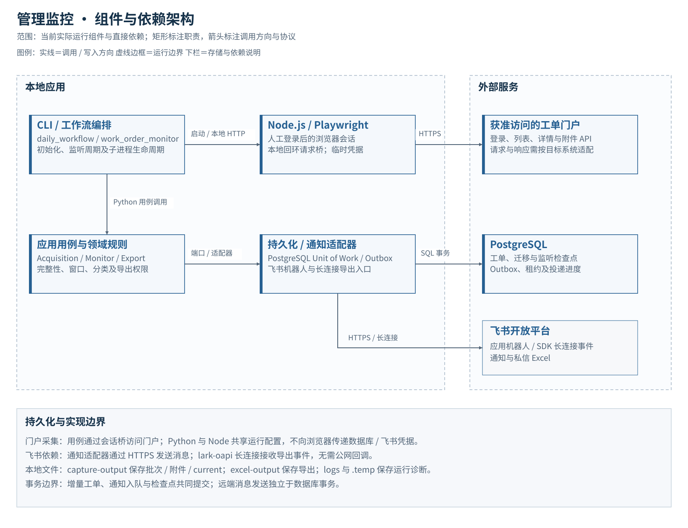

<div align="center">

# Management Monitor

**管理监控 · 从完整工单快照到可恢复通知**

[Python 3.10+](requirements.txt) · [Node.js / Playwright](package.json) · [PostgreSQL](database/DATABASE_USAGE.md) · 飞书应用机器人

[功能](#功能) · [工作流程](#工作流程) · [快速开始](#快速开始) · [运行与配置](#运行与配置) · [开发与文档](#开发与文档)

</div>

管理监控是面向工单门户的采集与通知工具。使用者在浏览器完成登录，程序复用会话采集列表、详情和附件，验证完整性后写入 PostgreSQL，持续监听新增工单，通过飞书通知并提供按日期自助导出 Excel。

> **接入状态：脱敏适配版本。** 仓库中的门户地址使用不可访问的示例域名，分类规则和导航样例也需要按目标系统调整。离线测试可以独立运行；真实业务运行需要门户授权、接口适配、PostgreSQL 和飞书应用配置。本项目提供命令行工作流，不包含独立 Web 管理界面。

## 功能

| 能力 | 当前行为 |
| --- | --- |
| 初始化采集 | 获取最近 30 个自然日工单，分页读取列表，补充详情与附件 |
| 完整快照 | 校验数量、关键字段、附件清单和文件证据，通过后发布 current 快照 |
| 增量监听 | 默认每轮后等待 60 秒；按检查点选择窗口，幂等写入新旧工单 |
| 可恢复通知 | 新工单、Outbox 和检查点在同一事务提交；记录消息及附件投递进度 |
| 飞书自助导出 | 长连接接收请求，按允许名单和日期范围查询，私信发送 Excel |
| 本地诊断 | 保存完整批次、失败暂存、运行摘要及脱敏日志，支持问题追溯 |

## 工作流程

[](assets/diagrams/workflow.svg)

按阶段从左到右阅读，各阶段内部从上到下；同名圆形连接符接续流程。点击图示可查看全尺寸。

- **完整性是发布条件。** 失败批次保留在暂存区，不覆盖上一份完整快照。初始化缺失列表、附件或数据库记录时，不进入常驻监听。
- **检查点跟随事务。** 增量采集失败或事务回滚时不推进窗口；下轮从原检查点重试。
- **通知可以恢复，但可能重复。** Outbox 使用租约、退避及投递进度；远端发送成功到本地确认之间发生中断，可能重复发送，不承诺 exactly-once。
- **导出独立校验授权。** 请求用户必须在允许名单内，文件私信发给请求者。初始化默认不生成本地 Excel。

## 架构

[](assets/diagrams/architecture.svg)

| 层次 | 实现与职责 |
| --- | --- |
| 工作流入口 | `workflows/` 组合初始化、监听、通知及导出，管理子进程与生命周期 |
| 应用与领域 | `safety_monitor/application/` 编排用例，`domain/` 定义工单、窗口与完整性规则 |
| 端口与适配器 | `ports/` 描述依赖契约，`adapters/` 接入 PostgreSQL、文件快照和飞书 |
| 门户访问 | Python 采集与 Node.js / Playwright 配合，通过有临时凭据的回环请求桥复用浏览器会话 |
| 数据与产物 | PostgreSQL 保存工单、检查点和通知状态；本地目录保存采集证据、附件和 Excel |

图示与实现入口对应关系见[制图说明](assets/diagrams/README.md)。

## 快速开始

需要 **Python 3.10+、Node.js 20+ 和 npm**。以下命令在 Windows PowerShell 执行：

```powershell
git clone https://github.com/TexcolCloud/management-monitor.git
cd management-monitor
python -m venv .venv
.\.venv\Scripts\Activate.ps1
python -m pip install -r requirements.txt
npm ci
npx playwright install chromium --only-shell
npm run check
```

`npm run check` 执行语法检查及 Python / Node 离线测试，不连接正式门户、数据库或飞书。安装依赖和浏览器需要网络；npm 镜像配置见 [.npmrc](.npmrc)。

### 接入真实系统

```powershell
Copy-Item .env.example .env
Copy-Item config/runtime.json config/runtime.local.json
npx playwright install chromium
```

1. 在 `.env` 设置 `WORKORDER_CONFIG=config/runtime.local.json`，填写 `PG*` 数据库连接及 `FEISHU_*` 应用配置。
2. 在本地 JSON 填写门户、列表、详情和附件地址。按目标门户核对请求参数、响应字段、分页、日期及附件结构；仅替换 URL 不一定能完成接入。
3. 配置飞书应用权限与通知目标。需要自助导出时开启 `FEISHU_EXPORT_ENABLED`，填写 `FEISHU_EXPORT_ALLOWED_OPEN_IDS`。
4. 启动工作流，在打开的浏览器中登录并手动进入目标页面：

```powershell
npm run workflow:daily -- --no-login-replay
```

初始化完成后进入持续监听，按 `Ctrl+C` 停止。也可以录制自己的导航路径，详见[配置与接入](docs/CONFIGURATION.md)。

## 运行与配置

| 命令 | 用途 |
| --- | --- |
| `npm run workflow:daily -- --no-login-replay` | 手动导航，执行初始化与监听 |
| `npm run workflow:daily` | 使用已配置的本地导航录制 |
| `npm run workflow:daily -- --no-login-replay --export-current` | 初始化时额外生成当前快照 Excel，随后继续监听 |
| `npm run feishu:export-listener` | 单独运行飞书导出监听；不要与主流程内监听重复启动 |
| `npm run record:portal-navigation` | 录制本地导航，保存到忽略路径 |
| `npm run feishu:latest-notification` | 对最新完整快照发送真实通知 |
| `npm run feishu:simulation` | 使用合成工单访问测试数据库并真实发送飞书消息 |

后两项是外部联调命令，应配置测试数据库与测试接收目标。它们不是离线演示。

配置优先级为进程环境变量、`.env`、JSON 默认值。完整字段见 [.env.example](.env.example) 和 [runtime.json](config/runtime.json)。默认输出如下：

| 路径或存储 | 内容 |
| --- | --- |
| `capture-output/daily-management/` | 采集批次、完整快照、附件及清单 |
| `excel-output/` | Excel 导出文件 |
| `.temp/` | 工作流结果和会话桥等临时运行状态 |
| `logs/` | 诊断日志 |
| PostgreSQL | 工单、迁移记录、监听检查点、Outbox 及投递进度 |

本版使用 `WORKORDER_` 配置前缀和通用数据库标识，不是原业务部署的直接升级包。数据库初始化和迁移行为见[数据库说明](database/DATABASE_USAGE.md)。

## 开发与文档

```powershell
npm run check
# 仅运行 Python 测试
python -m unittest discover -s tests -v
```

测试覆盖快照完整性、附件、事务、监听、通知恢复、导出权限与日志脱敏，使用临时目录和替身服务。目标门户的权限、真实响应以及飞书投递需要单独联调。

| 文档 | 内容 |
| --- | --- |
| [配置与接入](docs/CONFIGURATION.md) | 门户适配、配置、飞书和命令 |
| [架构说明](docs/ARCHITECTURE.md) | 领域、用例、端口与适配器 |
| [行为与测试映射](docs/BEHAVIOR_MATRIX.md) | 完整性、恢复与测试依据 |
| [数据库说明](database/DATABASE_USAGE.md) | 表、连接与迁移 |
| [运行维护](docs/OPERATIONS.md) | 故障与运行数据管理 |
| [采集模块](data_acquisition/README.md) / [导出模块](data_export/README.md) | 模块入口及产物 |

提交 Issue 或 PR 时请提供合成工单、复现步骤和相关测试。凭据、真实门户地址、用户标识、导航录制、认证状态和业务附件留在本机；忽略范围以 [.gitignore](.gitignore) 为准。
