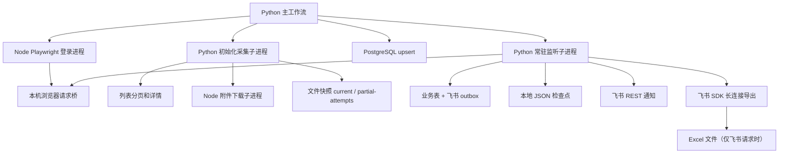
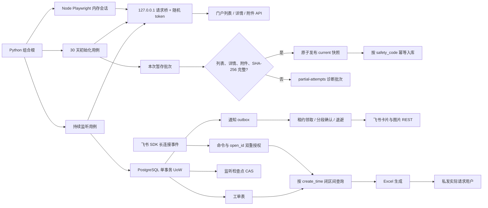

# 工单安全管理监控重构架构

## 1. 系统事实

本系统只有两类业务数据源：门户中的工单及附件，以及 PostgreSQL 中已经持久化的工单。门户是采集来源，PostgreSQL 是监听检查点、通知任务和 Excel 导出的事实来源；文件快照只用于发布本次完整采集结果和诊断失败批次，不能替代数据库事务。

业务身份是 `safety_code`。同一编号重复出现时只能更新同一条数据库记录，不能创建第二条业务记录或第二个通知任务。

主入口每次启动都执行最近 30 个自然日的初始化采集。开始边界为首日 `00:00:00`，结束边界为末日 `23:59:59.999999`，两端都包含。初始化和后续监听使用同一个登录浏览器会话。

## 2. 重构前数据流



重构前已经具备分页总数校验、详情失败隔离、文件暂存、PostgreSQL upsert、飞书 outbox 和卡片/图片分段进度，但这些能力分别散落在 CLI、文件工具和基础设施模块中。核心业务判断直接读取文件、环境变量或数据库，难以离线验证。

## 3. 主要问题

### P0：可能破坏兼容或丢失业务数据

- 最近 30 天结束边界实际只有秒精度，可能漏掉当天最后一秒内带微秒的数据。
- 历史 `001` 迁移曾被修改，旧数据库记录的 checksum 会让新版本拒绝启动。
- 快照完整性只看列表总数，未把详情和预期附件统一纳入发布条件。
- 模拟清理函数本身没有测试表名前缀保护，错误配置可能删除非模拟表。
- 旧实现曾把认证头、Token、Cookie 和响应预览写入运行文件；新主流程改为内存会话和受限本机请求桥，持久化诊断必须脱敏。

### P1：失败恢复和并发不明确

- 快照发布先移走 `current` 再移动新目录，进程中断时存在短暂无当前快照和备份清理风险。
- 监听检查点在数据库事务外写入本地 JSON；单进程不会丢数据，但多实例不能比较并交换推进。
- outbox 没有领取租约、退避和到期恢复，多实例可能重复发送，毒任务可能阻塞后续任务。
- outbox 仅在门户轮询成功后投递，门户故障会阻止已经持久化的通知重试。
- 外部发送成功与数据库确认不可能构成同一事务，进程在两者之间退出仍可能重复发送。

### P2：维护与诊断成本

- Python 和 Node 分别解释运行配置、认证头和路径，存在隐式全局状态。
- 初始采集和监听合并列表/详情的规则不一致。
- 多处旧日志和文档曾使用与实际 30 个自然日不一致的时间范围表述。
- 外部错误分类、日志脱敏和用户提示没有统一规则。

## 4. 目标边界

```text
safety_monitor/
  domain/         时间窗口、工单身份与合并、完整性、导出权限等纯规则
  application/    初始化快照、持续监听、通知投递、Excel 导出用例
  ports/          门户、快照、仓储、检查点、outbox、消息和文件生成接口
  adapters/       PostgreSQL、文件快照与飞书 outbox 投递适配器

common/           配置、脱敏日志、进程组合等兼容基础设施
data_acquisition/ Playwright 内存会话、HTTP/Node 采集适配器及旧 CLI 兼容层
database/         迁移入口与旧数据库 API 兼容层
workflows/        四个稳定命令的组合根，不承载领域规则
```

依赖只能由外向内：适配器依赖端口和应用用例，应用用例依赖领域规则和端口，领域层不导入 HTTP、Playwright、文件系统、PostgreSQL 或飞书 SDK。

### 4.1 目标运行数据流



随机 bridge token 只存在于父进程内存、短生命周期 ready 文件和需要访问 bridge 的子进程环境中；ready 文件读取后立即删除，token 不进入命令行或日志。Playwright 子进程不会继承 PostgreSQL、飞书或旧门户 Token 环境变量。

## 5. 关键事务边界

### 5.1 快照发布

采集先写入本次拥有的暂存目录。只有列表总数、所有详情和预期附件清单均完整，且附件文件/哈希可验证时，才允许发布。发布使用带事务标记的文件系统适配器；启动时可恢复未完成切换。部分结果只能移动到诊断目录，不能改变 `current`。清理只处理当前事务创建的临时项，不删除旧正式快照、正式附件或用户文件。

### 5.2 监听持久化

一个 PostgreSQL 事务完成：

1. 基于唯一 `safety_code` 写入或更新工单；
2. 为真正新增的工单创建唯一 outbox 任务；
3. 以期望旧检查点为条件推进 PostgreSQL 检查点；
4. 任一步骤失败则全部回滚。

旧 JSON 检查点只作为升级兼容输入和可选镜像，不能覆盖更晚的数据库检查点。

### 5.3 飞书 outbox

worker 用 `FOR UPDATE SKIP LOCKED` 和到期租约领取任务，数据库事务只覆盖领取或状态确认，不跨越附件下载和飞书网络调用。临时错误按有界指数退避重新排期，永久错误保留可诊断状态，不阻塞其他任务。

飞书发送采用明确的“至少一次”语义：卡片和每张图片分别记录进度；发送成功但确认前进程退出时可能重复。除非飞书接口提供并实际使用稳定幂等键，否则不能声称端到端恰好一次。

### 5.4 Excel 导出

导出是只读数据库用例，按 `create_time` 闭区间查询。`raw_data` 不完整或历史行为列缺失时仍保留整行，缺失单元格写空。生成文件只私发给通过允许名单校验的实际操作用户，临时文件在发送结束后清理。

## 6. 失败恢复矩阵

| 失败点 | 持久状态 | 恢复行为 |
| --- | --- | --- |
| 分页、详情或附件失败 | 仅诊断批次 | 不替换快照、不入库、不推进检查点 |
| 快照切换中断 | 暂存、标记或备份仍在 | 下次启动恢复到旧版或完成已验证切换 |
| 工单写入或 outbox 入队失败 | PostgreSQL 事务回滚 | 原检查点窗口重试 |
| 数据库提交后进程中断 | 工单、outbox、数据库检查点一致 | 从已提交检查点继续 |
| 门户不可用 | outbox 不受门户状态影响 | 通知 worker 仍领取并重试已有任务 |
| 飞书临时失败 | outbox 保存错误分类和下次时间 | 租约到期后按退避重试 |
| 飞书发送后、确认前中断 | 远端可能成功，本地仍待处理 | 至少一次重试，可能重复，日志明确说明 |
| Excel 查询或发送失败 | 不修改业务表或检查点 | 中文提示实际请求用户，可再次发起 |
| Ctrl+C | 已提交事务保留，未提交事务回滚 | 停止循环和子进程，不输出无意义 Traceback |

## 7. 迁移原则

- `001` 至 `004` 永久冻结，不再修改。
- 只对白名单内已知历史 `001` checksum 提供兼容，未知 checksum 仍拒绝启动。
- 新变更全部使用递增、additive 迁移；不得自动删除、重命名或覆盖用户表。
- 迁移使用 PostgreSQL advisory transaction lock 防止并发执行。
- 切换 `PGTABLE` 只创建/升级新目标表，不清理旧业务表、旧快照或旧附件。

## 8. 分阶段交付与风险控制

1. 复制当前源版本并运行特征测试，保留所有兼容入口。
2. 提取纯领域规则和端口，旧模块先委托新逻辑，不删除实现。
3. 修复时间边界、完整快照、历史迁移和模拟清理 P0 问题。
4. 增加数据库检查点、事务 UoW、outbox 租约与独立投递。
5. 收敛配置、错误分类、日志脱敏和中文用户提示。
6. 完整离线检查通过后才允许删除被测试证明等价的旧逻辑。

真实门户登录、正式 PostgreSQL 和真实飞书消息不属于默认验证。它们只能由运维人员使用显式命令和隔离配置执行。
